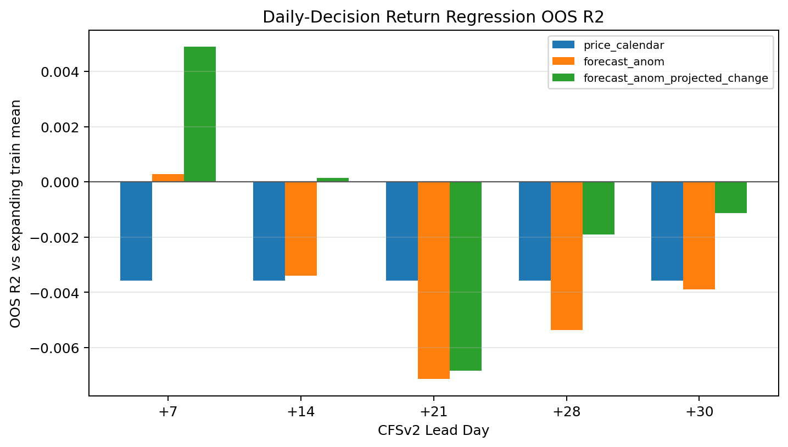
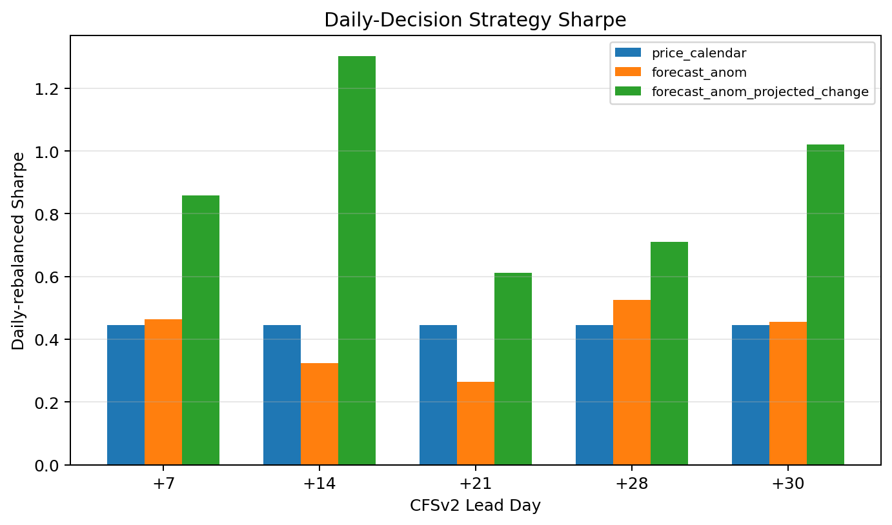
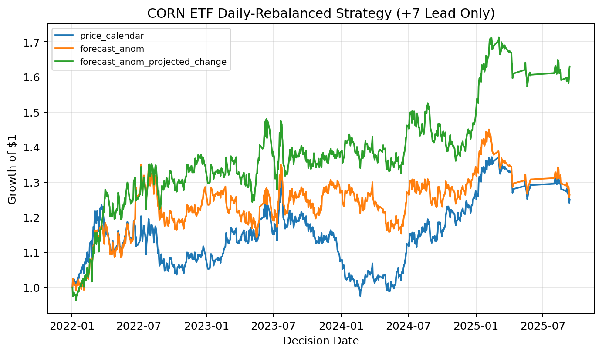
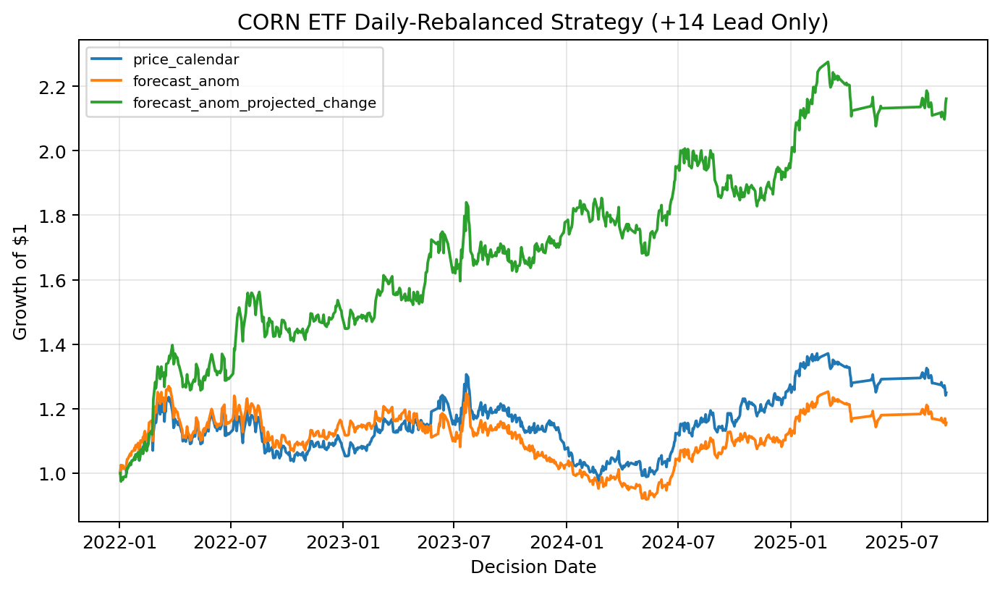
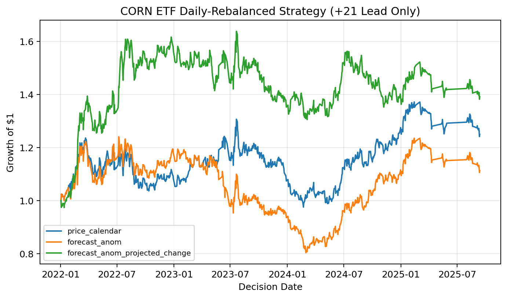

# Weather-Based CORN ETF Return Test

This folder contains the CFSv2 weather experiment for predicting CORN ETF returns.

The main script is:

```bash
python test_corn_etf_cfsv2_daily_decision_leadbylead_expanding_yearly.py --help
```

The stored outputs from one run are in:

```text
corn_etf_daily_decision_leadbylead_expanding_yearly/
```

That results directory has its own README with a file-by-file description of the saved CSV, JSON, and plot outputs:

```text
corn_etf_daily_decision_leadbylead_expanding_yearly/README.md
```

## Goal

The experiment tests whether short-horizon weather forecasts add predictive information for CORN ETF returns beyond price/calendar controls.

For each daily decision date, the target is the future 5-trading-day CORN ETF return:

```text
target_return_t = CORN_close_{t+5 trading days} / CORN_close_t - 1
```

The trading backtest uses a daily-rebalanced return, but the regression signal is still the predicted 5-trading-day return.

## Input Data

The script is designed to run on GLADE/Derecho and defaults to these paths:

```text
CFSv2 forecasts:
/glade/work/jiachengye/33200/cfsv2/validtime_yearly/

ERA5 observed surface weather:
/glade/work/jiachengye/33200/era5_daily_surface_stats_2011_2025_n49_w104_s37_e80.nc

GPCP observed precipitation:
/glade/work/jiachengye/33200/gpcp/stats/gpcp_daily_area_stats_20110101_20251231_north49_west104_south37_west80.nc
```

If `--price-csv` is not supplied, CORN ETF prices are downloaded from Yahoo Finance through `yfinance`.
If the Yahoo Finance download fails and `corn_etf_prices.csv` exists next to the script, the script falls back to that local CSV.

The repository also includes the processed weather inputs needed to reproduce the saved run:

```text
weather_data/validtime_yearly/cfsv2_daily00z_validtime_2011.nc
...
weather_data/validtime_yearly/cfsv2_daily00z_validtime_2025.nc

weather_data/era5_daily_surface_stats_2011_2025_n49_w104_s37_e80.nc

weather_data/gpcp_daily_area_stats_20110101_20251231_north49_west104_south37_west80.nc
weather_data/gpcp_daily_area_stats_20110101_20251231_north49_west104_south37_west80.csv
```

## Data Coverage And Provenance

All regional weather statistics use the same Corn Belt bounding box:

```text
north=49, west=-104, south=37, east=-80
```

The CFSv2 forecast data are NOAA CFSv2 operational 9-month forecasts initialized at 00Z. The downloaded source files are 6-hourly forecast products, but the processed yearly files keep a summary set of lead times:

```text
+7, +14, +21, +28, +30, +60, +90, +120, +150, +180, +210, +240, +270 days
```

For a 00Z initialization, these correspond to the following lead hours and valid times:

```text
+7 days   = 168 lead hours  = 00Z valid time 7 days after initialization
+14 days  = 336 lead hours  = 00Z valid time 14 days after initialization
+21 days  = 504 lead hours  = 00Z valid time 21 days after initialization
+28 days  = 672 lead hours  = 00Z valid time 28 days after initialization
+30 days  = 720 lead hours  = 00Z valid time 30 days after initialization
+60 days  = 1440 lead hours
+90 days  = 2160 lead hours
+120 days = 2880 lead hours
+150 days = 3600 lead hours
+180 days = 4320 lead hours
+210 days = 5040 lead hours
+240 days = 5760 lead hours
+270 days = 6480 lead hours
```

The return model uses the short-horizon subset:

```text
+7, +14, +21, +28, +30
```

Each lead is modeled separately. The yearly CFSv2 files are valid-time matched: for a row with valid date `t` and lead `h`, the source initialization date is `t - h`.

ERA5 observed surface weather covers 2011-2025 and is stored here only as a postprocessed regional statistics file because the raw downloaded ERA5 data are too large for the repository. The model reads ERA5 near-surface temperature and specific humidity from:

```text
weather_data/era5_daily_surface_stats_2011_2025_n49_w104_s37_e80.nc
```

GPCP observed precipitation covers 2011-01-01 through 2025-12-31. The repository includes both NetCDF and CSV regional daily precipitation statistics:

```text
weather_data/gpcp_daily_area_stats_20110101_20251231_north49_west104_south37_west80.nc
weather_data/gpcp_daily_area_stats_20110101_20251231_north49_west104_south37_west80.csv
```

## Data Preparation Scripts

`download_cfsv2_00z_derecho_parallel.py` downloads CFSv2 00Z operational forecast files on Derecho and computes daily-initialization regional forecast statistics for:

```text
t2m, spfh, precip
```

Its default output layout is:

```text
/glade/work/jiachengye/33200/cfsv2/daily00z/YYYY/t2m_YYYYMMDD00.nc
/glade/work/jiachengye/33200/cfsv2/daily00z/YYYY/spfh_YYYYMMDD00.nc
/glade/work/jiachengye/33200/cfsv2/daily00z/YYYY/precip_YYYYMMDD00.nc
```

`test1_era5_load.py` is a legacy/non-parallel version of the CFSv2 daily-initialization processing workflow. Despite the filename, it is not the ERA5 postprocessing script.

`build_cfsv2_validtime_yearly.py` reorganizes those daily-initialization CFSv2 files by valid date and writes:

```text
cfsv2_daily00z_validtime_YYYY.nc
```

`test_gpcp_download.py` downloads GPCP daily precipitation and computes the regional precipitation statistics.

`recompute_gpcp_stats.py` recomputes the same GPCP regional statistics from already downloaded daily GPCP files. This is useful when the daily files already exist on GLADE and only the regional NetCDF/CSV needs to be rebuilt.

The ERA5 regional surface statistics file is an input to this repository. The raw ERA5 download and processing step is not included here because the raw data volume is large.

`download_corn_etf_prices.py` downloads CORN ETF daily prices into the CSV format accepted by the return-regression script.

## Weather Feature Construction

CFSv2 forecast anomalies are computed relative to lead-specific CFSv2 model climatology:

```text
forecast_anom_{t,h} = CFSv2_forecast_{t,h} - CFSv2_climatology_{h, day-of-year}
```

The default climatology mode is `expanding`, so each date only uses earlier dates when estimating climatology. The day-of-year climatology uses a 10-day window.

The script also builds initialization observed anomalies from ERA5/GPCP using a trailing 7-day average shifted by one day to avoid look-ahead.

The main weather variables are:

```text
heat_forecast_z = z-scored CFSv2 temperature anomaly
dryness_forecast_z = -1 * z-scored CFSv2 precipitation anomaly
heat_x_dryness = heat_forecast_z * dryness_forecast_z
```

Projected-change variables compare the forecast anomaly with the initialization observed anomaly:

```text
heat_projected_change = heat_forecast_z - init_obs_heat_z
dryness_projected_change = dryness_forecast_z - init_obs_dryness_z
projected_heat_x_dryness = heat_projected_change * dryness_projected_change
```

Higher heat and higher dryness are both coded as higher supply-risk signals.

## Models

For each lead day, the script fits three Ridge regression specifications.

`price_calendar`:

```text
target_return ~ price lags + volatility + momentum + calendar/season controls
```

`forecast_anom`:

```text
target_return ~ price_calendar + heat_forecast_z + dryness_forecast_z + heat_x_dryness
```

`forecast_anom_projected_change`:

```text
target_return ~ price_calendar
              + heat_forecast_z + dryness_forecast_z + heat_x_dryness
              + heat_projected_change + dryness_projected_change + projected_heat_x_dryness
```

All regressions use:

```text
SimpleImputer(strategy="median")
StandardScaler()
Ridge regression
```

The Ridge alpha is selected by `TimeSeriesSplit` cross-validation.

## Expanding-Yearly Evaluation

The default evaluation uses an expanding yearly out-of-sample design:

```text
Predict 2022 with training years 2011-2021
Predict 2023 with training years 2011-2022
Predict 2024 with training years 2011-2023
Predict 2025 with training years 2011-2024
```

For each test year, the Ridge alpha is selected inside the training window, then the model is refit on the full expanding training set and evaluated on that test year.

## Trading Rule

The predicted 5-trading-day return is converted into a daily position:

```text
if predicted_return > signal_buffer:  position = +1
if predicted_return < -signal_buffer: position = -1
otherwise:                            position = 0
```

The no-buffer stored run in `corn_etf_daily_decision_leadbylead_expanding_yearly/signal_buffer_0p0pct/` used:

```text
signal_buffer = 0.0
transaction_cost_bps = 5.0
```

The plotted equity curves use daily-rebalanced one-day realized returns:

```text
strategy_return_t = position_t * next_1d_return_t - transaction_cost
```

The `signal_5td_proxy_*` metrics compound overlapping 5-trading-day signal returns and should be read as signal diagnostics, not as directly investable portfolio returns.

## Regression Setup And Main Results

For each CFSv2 lead, `decision_date` is the forecast initialization date and `valid_date = decision_date + lead`. For example, the +7 model uses the 00Z forecast initialized on the decision date for weather conditions valid 7 days later; the +14 model uses the same 00Z initialization but weather conditions valid 14 days later.

The regression target is:

```text
target_return_t = CORN_close_{t+5 trading days} / CORN_close_t - 1
```

The three lead-by-lead regression specifications are:

```text
Model 0: price_calendar
target_return
~ price_return_lag_{1,2,5,10,21d}
+ price_vol_{5,10,21,63d}
+ price_momentum_{5,10,21,63d}
+ month, quarter, week-of-year sin/cos, day-of-week sin/cos
+ planting, pollination, harvest, winter-storage dummies

Model 1: forecast_anom
target_return
~ price_calendar
+ heat_forecast_z_l{lead}
+ dryness_forecast_z_l{lead}
+ heat_forecast_z_l{lead} * dryness_forecast_z_l{lead}

Model 2: forecast_anom_projected_change
target_return
~ forecast_anom model
+ heat_projected_change_l{lead}
+ dryness_projected_change_l{lead}
+ heat_projected_change_l{lead} * dryness_projected_change_l{lead}
```

Here `heat_forecast_z` is the z-scored CFSv2 temperature anomaly relative to the lead-specific CFSv2 annual climatology. `dryness_forecast_z` is `-1 * precipitation z-score`, so larger values mean drier forecast conditions. Projected-change variables compare the forecast anomaly with the initialization observed anomaly from ERA5/GPCP.

The no-buffer results below use the long/short rule:

```text
long  if predicted_return > 0.0%
short if predicted_return < 0.0%
```

Out-of-sample R2 is measured against the expanding training-window mean return. The +7 and +14 day 00Z forecast models have the clearest positive R2 results, with +7 fitting best in the current run. The projected-change model is the strongest +7 specification.



The Sharpe-ratio comparison shows the same pattern: using projected change together with the climatological forecast anomaly generally improves over using the forecast anomaly alone, and is comparable to or better than the price/calendar baseline.



Realized daily-rebalanced equity curves are strongest for the short leads. In this 0.0% threshold long/short strategy, +7 reaches roughly 1.6-1.7x growth of $1 and +14 reaches roughly 2x over the 2022-2025 out-of-sample period.

| +7 Lead | +14 Lead | +21 Lead |
|---|---|---|
|  |  |  |

Overall, the strongest signal comes from short-horizon forecast information, especially when the model combines CFSv2 anomaly relative to the annual cycle with projected change from the current observed weather state.

## Interpretation Notes

The discussion below refers to the no-buffer `signal_buffer_0p0pct` results used for the main class-project comparison.

### Discussion

The main empirical question is whether subseasonal weather forecast information contains incremental predictive content for CORN ETF returns beyond standard price and calendar controls. The results suggest that the answer is conditionally yes, but the useful signal is concentrated in short leads and is stronger when the model uses both forecast anomalies and projected-change anomalies.

The price/calendar model is a demanding baseline because it already includes lagged returns, recent volatility, momentum, month and quarter controls, cyclical week-of-year and day-of-week controls, and crop-season dummies. Therefore, the weather models are not simply being compared against a naive constant-return benchmark. They are tested on whether CFSv2 weather forecast information improves prediction after controlling for basic price dynamics and seasonality.

Across the tested leads, the clearest evidence appears at the short forecast horizons, especially the +7-day and +14-day leads. This is economically intuitive. CORN ETF is a futures-based corn exposure, so the most relevant weather information is likely information that can change market expectations over the next several trading days. Longer-lead forecasts may still contain useful climate information, but their noise level and forecast uncertainty are higher, which can weaken their relationship with short-horizon ETF returns.

The comparison between the `forecast_anom` and `forecast_anom_projected_change` models is especially important. The `forecast_anom` model asks whether the CFSv2 forecast is hot or dry relative to the model's lead-specific annual cycle. The projected-change variables ask a more market-relevant question: given the weather conditions already observed near the decision date, does the forecast imply that heat or dryness risk will intensify or fade? This distinction matters because futures prices should respond more to new information than to weather states that are already known or already priced. In the +7-day equity curve, the projected-change model produces the strongest cumulative growth among the three model specifications, suggesting that the change from current observed conditions to forecasted future conditions is more informative than the forecast anomaly level alone.

The trading results should be interpreted as exploratory rather than as a production trading system. The regression target is the future 5-trading-day CORN ETF return, but the plotted trading strategy converts the predicted 5-day return into a daily long/short position and compounds realized next-day returns. This makes the equity curves useful for comparing signals, but they are not a fully realistic implementation of a weekly holding-period strategy. In addition, transaction costs are included in a simplified way, and the backtest does not model all real-world frictions such as bid-ask spreads, ETF liquidity, borrow costs for short positions, tax treatment, or market impact.

A second caution is that regression fit and trading performance are not identical. A model can improve OOS R2 or prediction-realized correlation without always producing the highest Sharpe ratio, because trading performance also depends on the sign threshold, position turnover, return volatility, and drawdown profile. For this reason, the most convincing evidence is not any single metric, but the joint pattern across OOS R2, correlation, direction accuracy, Sharpe ratio, drawdown, and equity-curve behavior.

The current results are consistent with the idea that short-horizon CFSv2 forecasts contain some tradable information for CORN ETF returns, particularly when forecast anomalies are measured relative to the current observed weather state. However, the effect is not uniform across all leads or all model specifications. The strongest conclusion is therefore not that weather forecasts mechanically predict CORN ETF returns, but that projected changes in Corn Belt heat and dryness forecasts appear to add incremental information beyond price/calendar controls in the 2022-2025 out-of-sample period.

### Economic Interpretation

The economic mechanism is based on corn supply risk. CORN ETF provides exchange-traded exposure to CBOT corn futures rather than physical corn. Because corn futures prices reflect market expectations about future corn supply and demand, weather forecasts can matter when they change expectations about crop stress, yield risk, harvest conditions, or storage and transportation risk. During the U.S. growing season, hot and dry Corn Belt forecasts are plausibly bullish because they can increase expected supply risk. Outside the main growing season, the interpretation is less direct, which motivates future work using season-specific weather factors.

The projected-change model has a natural economic interpretation. A hot and dry forecast may not be new information if the Corn Belt is already hot and dry. But a forecast that implies a transition from normal current conditions to much hotter or drier future conditions may represent a more meaningful update to market expectations. This is why the projected-change variables may capture a more tradable signal than the forecast anomaly variables alone.

### Limitations

Several limitations should be kept in mind.

First, the test period is short. The out-of-sample evaluation covers 2022-2025, which is useful for a realistic expanding-window design but still represents only a small number of market regimes.

Second, the current model uses a single Corn Belt bounding box. This is a reasonable MVP design, but corn futures prices also respond to weather in other regions, especially South America during the U.S. winter. Future versions could add Brazil and Argentina corn-region weather factors for December-May.

Third, the same heat and dryness variables are currently used across the full calendar year. This is simple and transparent, but the economic meaning of weather changes across the crop cycle. For example, hot and dry conditions are most relevant during pollination, wet and cold conditions may matter more during planting, wet conditions may delay harvest, and winter U.S. Corn Belt weather is less directly tied to current U.S. corn production. A season-gated specification could allow weather variables to have different coefficients during planting, pollination, harvest, and winter-storage periods.

Fourth, the backtest uses simplified trading assumptions. The long/short rule is useful for measuring whether model predictions have directional value, but a more conservative strategy would use a signal buffer or a long/cash rule. This may be more realistic because bearish weather signals are not necessarily symmetric with bullish supply-risk signals.

### Suggested Extensions

1. Add season-specific weather interactions. Instead of applying the same heat and dryness coefficients throughout the year, interact weather factors with planting, pollination, harvest, and winter-storage indicators.

2. Add forecast-revision variables. A useful next feature is the change in the forecast for the same valid date from one decision date to the next. This would better capture new information entering the market.

3. Add South America weather factors for December-May. U.S. Corn Belt weather is less relevant after harvest, but Brazil and Argentina weather can still affect global corn supply expectations during the U.S. winter.

4. Compare daily-rebalanced and 5-trading-day holding-period strategies. Since the regression target is a 5-trading-day return, a non-overlapping or weekly holding-period backtest would be a useful robustness check.

5. Evaluate long/cash rules in addition to long/short rules. A thresholded long/cash strategy may better reflect the asymmetric interpretation of weather signals: hot/dry crop stress may be bullish, while benign weather does not necessarily imply an equally strong bearish trade.

## Main Command

Example Derecho command for the no-buffer (`signal_buffer_0p0pct`) result:

```bash
python test_corn_etf_cfsv2_daily_decision_leadbylead_expanding_yearly.py \
  --cfsv2-root /glade/work/jiachengye/33200/cfsv2/validtime_yearly \
  --era5-path /glade/work/jiachengye/33200/era5_daily_surface_stats_2011_2025_n49_w104_s37_e80.nc \
  --gpcp-path /glade/work/jiachengye/33200/gpcp/stats/gpcp_daily_area_stats_20110101_20251231_north49_west104_south37_west80.nc \
  --price-csv corn_etf_prices.csv \
  --out-dir corn_etf_daily_decision_leadbylead_expanding_yearly/signal_buffer_0p0pct \
  --signal-buffer 0.0 \
  --make-plots \
  --overwrite
```

The script can also be run from the repository root by overriding the GLADE defaults with repo-relative paths:

```bash
python weather_corn_etf/test_corn_etf_cfsv2_daily_decision_leadbylead_expanding_yearly.py \
  --cfsv2-root weather_corn_etf/weather_data/validtime_yearly \
  --era5-path weather_corn_etf/weather_data/era5_daily_surface_stats_2011_2025_n49_w104_s37_e80.nc \
  --gpcp-path weather_corn_etf/weather_data/gpcp_daily_area_stats_20110101_20251231_north49_west104_south37_west80.nc \
  --price-csv weather_corn_etf/corn_etf_prices.csv \
  --out-dir weather_corn_etf/corn_etf_daily_decision_leadbylead_expanding_yearly/signal_buffer_0p0pct \
  --signal-buffer 0.0 \
  --make-plots \
  --overwrite
```

## Outputs

The script writes:

```text
cfsv2_corn_etf_daily_decision_feature_panel.csv
cfsv2_corn_etf_daily_decision_regression_predictions.csv
cfsv2_corn_etf_daily_decision_regression_metrics.csv
cfsv2_corn_etf_daily_decision_metadata.json
plots/
```

See `corn_etf_daily_decision_leadbylead_expanding_yearly/README.md` for a file-by-file description of the saved results.
